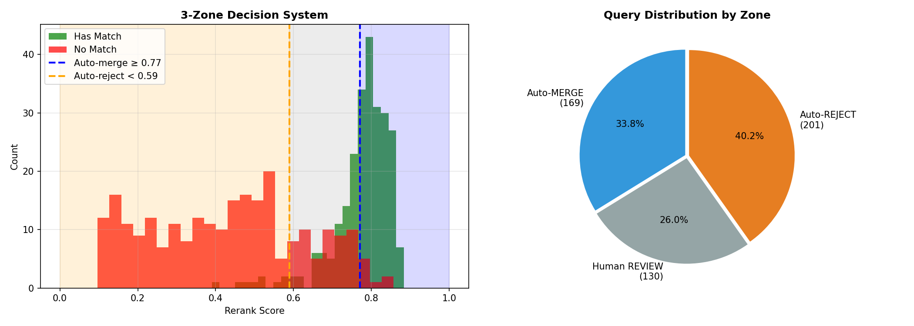
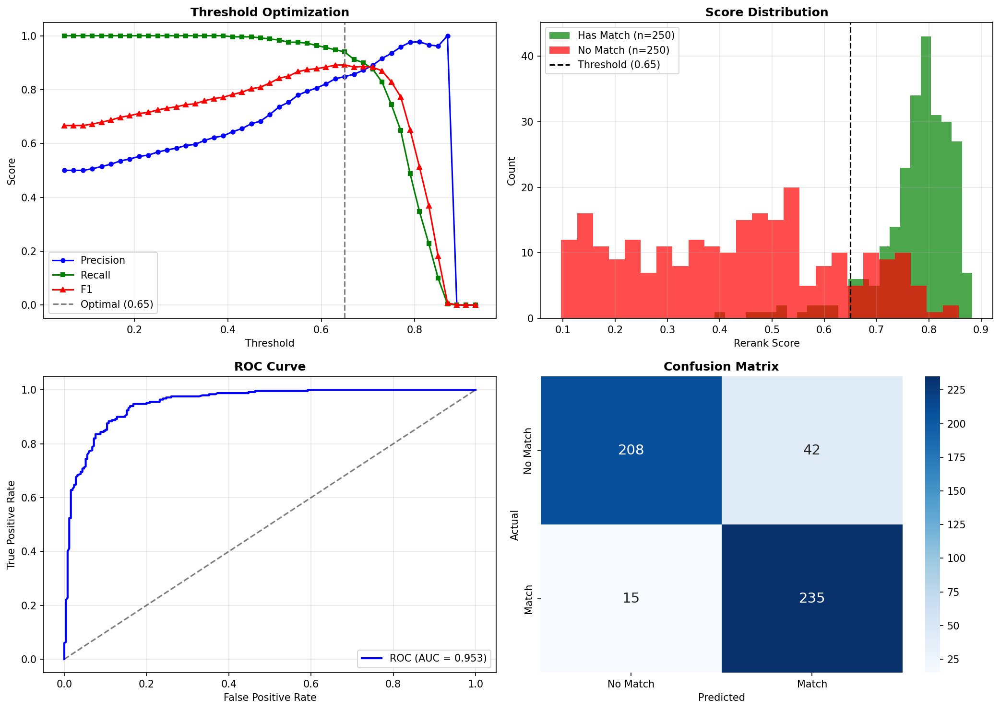
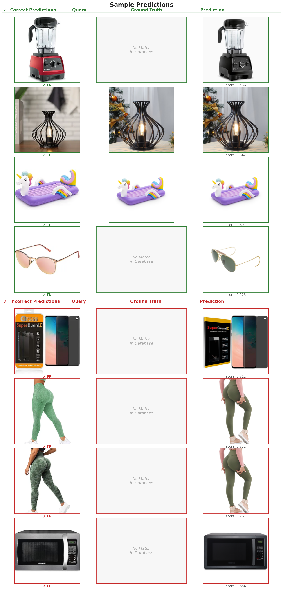

# 🎯 Two-Stage Multimodal Product Matching System


A two-stage multimodal product matching pipeline combining **Qwen3-VL-Embedding-2B** (bi-encoder retrieval) and **Qwen3-VL-Reranker-2B** (cross-encoder reranking) with a data-driven **3-zone decision system** (Auto-MERGE / Human-REVIEW / Auto-REJECT). Evaluated on the **ProMapEn** dataset (904 Amazon & Walmart products). The reranker uses a detailed prompt covering **10 critical product attributes** (brand, size, color, pack count, condition, price, model year, flavor, accessories, region). GPU memory is managed via **model swapping** to fit within 12 GB VRAM. Achieves **~74% automation rate** with **95%+ precision** in automated decisions.

---

## Key Results

| Metric | Value |
|--------|-------|
| **AUC-ROC** | 0.9533 |
| **F1 Score** | 0.8918 |
| **Precision** | 0.8484 |
| **Recall** | 0.9400 |
| **Recall@1** | 0.9440 (after reranking) |
| **MRR** | 0.9720 |

---

## Problem

Product matching in e-commerce platforms involves identifying identical products listed by different sellers. This is critical for duplicate listing prevention, product catalog enrichment, price comparison, and inventory consolidation.


> **Key Insight: Similarity != Identity**
> Two products can be visually and textually very similar but have different sizes, colors, or package contents. Embedding similarity alone is not sufficient -- cross-encoder reranking is needed to verify true matches.
>


---

## Solution Architecture

```
+-------------------------------------------------------------------------+
|                  TWO-STAGE PRODUCT MATCHING PIPELINE                     |
+-------------------------------------------------------------------------+
|                                                                          |
|  +-------------+    +------------------+    +-------------------------+  |
|  |  New        |    |  STAGE 1:        |    |  Top-5 Candidates       |  |
|  |  Product    |--->|  RETRIEVAL       |--->|  (ChromaDB + HNSW)      |  |
|  |  (img+text) |    |  ~0.02s/query    |    |  Recall@5 = 100%        |  |
|  +-------------+    +------------------+    +-----------+-------------+  |
|                                                         |                |
|                                                         v                |
|                     +------------------+    +-------------------------+  |
|                     |  STAGE 2:        |    |  Decision Zone          |  |
|                     |  RERANKING       |--->|  Auto-Merge / Review /  |  |
|                     |  ~0.5s/query     |    |  Auto-Reject            |  |
|                     +------------------+    +-------------------------+  |
|                                                                          |
+-------------------------------------------------------------------------+
|  MODELS                                                                  |
|  - Retrieval: Qwen3-VL-Embedding-2B (Bi-encoder, multimodal)            |
|  - Reranking: Qwen3-VL-Reranker-2B (Cross-encoder, multimodal)          |
+-------------------------------------------------------------------------+
```

---

## Why Two Stages? / Neden İki Aşama?

| Stage | Model | Complexity | Speed | Purpose |
|-------|-------|------------|-------|---------|
| **Retrieval** | Bi-encoder | O(log N) | ~0.02s | Find similar candidates fast / Hızlıca benzer adayları bul |
| **Reranking** | Cross-encoder | O(K) | ~0.5s | Verify true identity match / Gerçek eşleştirmeyi doğrula |

- **Stage 1 (Retrieval):** Rapidly narrows millions of products down to top-K candidates
- **Stage 2 (Reranking):** Acts as "second pair of eyes" comparing query-candidate pairs jointly

**Why isn't embedding similarity enough?** Products with high similarity scores can still be different products. The reranker uses cross-attention to jointly analyze query and candidate, catching subtle differences (pack size, color, model variant).

---

## Production Strategy: Human-in-the-Loop

Thresholds are **data-driven** (optimized for 95% precision target):

```
+---------------------------------------------------------------+
|  Score >= 0.77  ->  Auto-MERGE   (Model confident, auto-merge) |
|  Score <  0.59  ->  Auto-REJECT  (Model confident, auto-reject)|
|  0.59 - 0.77   ->  Human-REVIEW (Uncertain, human review)      |
+---------------------------------------------------------------+
```



With this strategy:
- **~74%** of queries handled automatically (Auto-Merge + Auto-Reject)
- **~26%** routed to human review
- **95%+** precision guaranteed in automated decisions


---

## Technical Stack

| Component | Technology |
|-----------|------------|
| **Dataset** | [ProMapEn](https://github.com/kackamac/Product-Mapping-Datasets) (Amazon vs Walmart pairs) |
| **Retrieval** | [ChromaDB](https://docs.trychroma.com/) + HNSW Index |
| **Embedding** | [Qwen3-VL-Embedding-2B](https://huggingface.co/Qwen/Qwen3-VL-Embedding-2B) |
| **Reranking** | [Qwen3-VL-Reranker-2B](https://huggingface.co/Qwen/Qwen3-VL-Reranker-2B) |
| **Hardware** | NVIDIA RTX 5070 Ti (12GB VRAM) |

---

## Project Structure

```
product-matching/
├── dataset/
│   ├── products.csv              # 404 products (Walmart - DB)
│   ├── queries.csv               # 500 queries (Amazon - test)
│   └── images/                   # Product images (~1300 files)
├── scripts/
│   ├── qwen3_vl_embedding.py     # Embedding model wrapper
│   ├── export_results_to_excel.py    # Excel report generator
│   ├── qwen3_vl_reranker.py      # Reranker model wrapper
│   └── prepare_dataset.py        # Dataset download & preparation
├── figs/                         # Generated evaluation charts
│   ├── evaluation_results_v2.png # ROC, Confusion Matrix
│   ├── production_thresholds.png # 3-zone decision system
│   ├── predictions_grid.png      # Sample predictions grid
│   └── reranking_analysis.png    # Reranking value analysis
├── main.ipynb   # Main pipeline notebook
├── investigation.ipynb           # Error analysis & FP investigation
├── results.xlsx # Detailed results with images
├── requirements.txt
└── README.md
```

---

## Quick Start

### 1. Setup Environment

```bash
# Create virtual environment
python -m venv .venv
.venv\Scripts\activate  # Windows
# or
source .venv/bin/activate  # Linux/Mac

# Install dependencies
pip install -r requirements.txt
```

### 2. Prepare Dataset (optional, already included)

```bash
python scripts/prepare_dataset.py
```

### 3. Run Pipeline

```bash
jupyter notebook main.ipynb
```

### 4. Notebook Sections

1. **Setup & Configuration** - Model and path settings
2. **Data Loading** - Load and preview ProMapEn dataset
3. **Phase 1: Indexing** - Embed products into ChromaDB
4. **Phase 2: Query Embeddings** - Compute query embeddings
5. **Phase 3: Retrieval** - Top-K candidate retrieval
6. **Phase 4: Reranking** - Cross-encoder scoring
7. **Phase 5: Evaluation** - Metrics, threshold optimization, visualizations
8. **Demo** - Live pipeline demonstration
9. **Export** - Results to Excel with embedded images

---

## Evaluation Results



### Stage 1: Retrieval Performance

| Metric | Value |
|--------|-------|
| Recall@1 | 0.9440 |
| Recall@3 | 0.9960 |
| Recall@5 | 1.0000 |
| MRR | 0.9701 |

### Stage 2: Reranking Performance

| Metric | Value |
|--------|-------|
| Recall@1 | 0.9440 |
| Recall@3 | 1.0000 |
| MRR | 0.9720 |

### Binary Classification

| Metric | Value |
|--------|-------|
| Threshold | 0.65 |
| Precision | 0.8484 |
| Recall | 0.9400 |
| F1 Score | 0.8918 |
| AUC-ROC | 0.9533 |

### Stage Comparison

| Metric | Retrieval | Reranking | Delta |
|--------|-----------|-----------|-------|
| Recall@1 | 0.9440 | 0.9440 | +0.0000 |
| Recall@3 | 0.9960 | 1.0000 | +0.0040 |
| MRR | 0.9701 | 0.9720 | +0.0019 |

---

## Sample Predictions



---

## Error Analysis

Detailed error analysis is available in `investigation.ipynb`. Key findings:

- **12 FP (wrong match)** cases: Model retrieved a similar but incorrect product variant (different pack size, carrier, or condition)
- **46 FP (no match)** cases: Model predicted a match for queries without a ground truth match in DB. Visual inspection reveals many of these predictions are actually reasonable -- the retrieved products are visually near-identical
- **Dataset quality limitation:** Some ground truth labels appear incorrect; the model's predictions are sometimes more accurate than the labeled ground truth

**Business insight:** In production, false positives (wrong merges) are more critical than false negatives (missed merges). A wrong merge corrupts the product catalog and harms customer experience. The 3-zone system mitigates this risk by routing uncertain cases to human reviewers.

---

## Performance Optimizations

1. **Top-K = 5 is sufficient:** Recall@5 = 100%, no need to rerank more than 5 candidates
2. **GPU Memory Management:** Model swapping (load embedding -> unload -> load reranker) keeps VRAM usage within 12GB
3. **Batch Processing:** Embeddings computed in batches of 10 for throughput

---

## Output Files

Files generated when the notebook runs:

| File | Description |
|------|-------------|
| `results.xlsx` | Detailed results with embedded images |
| `figs/evaluation_results_v2.png` | ROC curve, Confusion Matrix |
| `figs/production_thresholds.png` | 3-zone decision visualization |
| `figs/predictions_grid.png` | Sample predictions (Query -> GT -> Prediction) |
| `figs/reranking_analysis.png` | Reranking value analysis |

---

## Hardware Requirements

| Spec | Minimum | Recommended |
|------|---------|-------------|
| **VRAM** | 8GB (with model swap) | 12GB+ |
| **RAM** | 16GB | 32GB |
| **CPU** | 4 cores | 8+ cores |

---

## Dataset Attribution

This project uses the **ProMapEn** dataset for evaluation:

> Kackamac, *Product Mapping Datasets*, GitHub repository.
> https://github.com/kackamac/Product-Mapping-Datasets

The dataset contains Amazon vs Walmart product pairs with match/no-match labels. We use 404 Walmart products as the database (250 matched + 154 distractors) and 500 Amazon products as queries (250 with match, 250 without match) for evaluation — 904 products in total.

---

## References

- [Qwen3-VL-Embedding-2B](https://huggingface.co/Qwen/Qwen3-VL-Embedding-2B) - Multimodal embedding model
- [Qwen3-VL-Reranker-2B](https://huggingface.co/Qwen/Qwen3-VL-Reranker-2B) - Cross-encoder reranker model
- [ChromaDB](https://docs.trychroma.com/) - Vector database with HNSW indexing
- [ProMapEn Dataset](https://github.com/kackamac/Product-Mapping-Datasets) - Amazon vs Walmart product pairs

---
